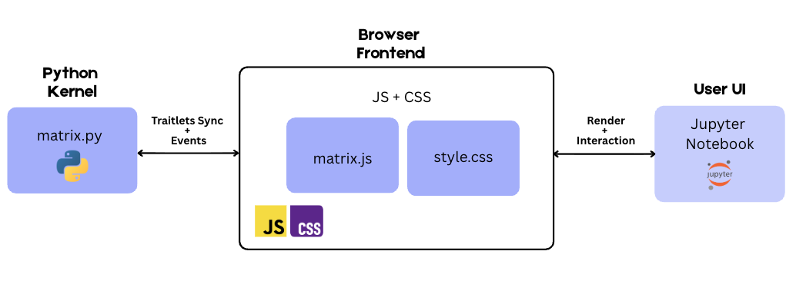

# 🎨 BESTLIB - Interactive Matrix Layout Library

Librería Python para crear layouts interactivos basados en grids ASCII con visualizaciones D3.js integradas y comunicación bidireccional Python ↔ JavaScript.



## ✨ Características Principales

- ✅ **Layouts ASCII**: Define grids visuales con arte ASCII simple
- ✅ **Merge de Celdas**: Combina celdas automáticamente
- ✅ **Elementos Visuales Simples**: Círculos, rectángulos, líneas sin D3
- ✅ **Gráficos D3.js**: Bar charts, scatter plots, sunburst, radar, stream
- ✅ **Interactividad**: Selección, zoom, tooltips automáticos
- ✅ **Comunicación Bidireccional**: Eventos JS → Python en tiempo real
- ✅ **🆕 Selección Automática**: `get_selection()` sin callbacks manuales
- ✅ **🆕 Linked Views**: Sincronización entre múltiples gráficos
- ✅ **🆕 Nuevos Tipos de Gráfico**: Sunburst, Radar, Stream, Scatter mejorado
- ✅ **Safe HTML**: Renderizado seguro por defecto

## 🚀 Instalación

```bash
cd bestlib
pip install -e .
```

## 📖 Quick Start

### 1. Layout Básico con HTML

```python
from BESTLIB.matrix import MatrixLayout

MatrixLayout.map({
    'T': '<h2>Mi Dashboard</h2>',
    'C': '<div>Contenido aquí</div>'
})

layout = MatrixLayout("""
TTT
CCC
""")

layout
```

### 2. Elementos Visuales Simples

```python
MatrixLayout.map({
    'C': {
        'shape': 'circle',
        'color': '#e74c3c',
        'size': 40,
        'title': 'Círculo'
    },
    'R': {
        'shape': 'rect',
        'color': '#3498db',
        'width': 80,
        'height': 50,
        'borderRadius': 5
    },
    'L': {
        'shape': 'line',
        'color': '#2ecc71',
        'strokeWidth': 5
    }
})

layout = MatrixLayout("CRL")
layout
```

### 3. Gráfico de Barras Interactivo

```python
# Datos
data = [
    {"category": "A", "value": 10},
    {"category": "B", "value": 20},
    {"category": "C", "value": 15}
]

# Configurar
MatrixLayout.map({
    'B': {
        "type": "bar",
        "data": data,
        "color": "#4a90e2",
        "interactive": True,  # Habilita selección
        "axes": True
    }
})

# Crear layout con callback
layout = MatrixLayout("BBB")

# Variable para almacenar selección
selected_data = []

def on_select(payload):
    global selected_data
    selected_data = payload.get('items', [])
    print(f"✅ Seleccionados: {len(selected_data)} elementos")

layout.on('select', on_select)
layout
```

### 4. Scatter Plot con Zoom

```python
# Datos
scatter_data = [
    {"x": 1, "y": 2, "label": "Punto 1", "color": "#e74c3c"},
    {"x": 3, "y": 4, "label": "Punto 2", "color": "#3498db"},
    # ...
]

# Configurar
MatrixLayout.map({
    'S': {
        "type": "scatter",
        "data": scatter_data,
        "pointRadius": 5,
        "interactive": True,
        "zoom": True,  # Habilita zoom
        "axes": True
    }
})

# Callbacks
layout = MatrixLayout("SSS")

layout.on('point_click', lambda p: print(f"Click: {p['point']['label']}"))\
      .on('select', lambda p: print(f"Seleccionados: {len(p['items'])}"))

layout
```

### 🆕 5. Selección Automática de Datos

```python
# Sin callbacks manuales - acceso directo
layout = MatrixLayout("BBB")

# Interactuar con el gráfico, luego:
selection = layout.get_selection('select')
if selection:
    items = selection.get('items', [])
    print(f"Seleccionados: {len(items)} elementos")
    print(f"Datos: {items}")
```

### 🆕 6. Linked Views

```python
# Crear múltiples layouts
layout1 = MatrixLayout("B")
layout2 = MatrixLayout("S")
layout3 = MatrixLayout("R")

# Linkear con modo highlight
group_id = MatrixLayout.link_views([layout1, layout2, layout3], mode='highlight')

# Linkear con modo filter
filter_group = MatrixLayout.link_views([layout1, layout2], mode='filter')

# Deslinkear
MatrixLayout.unlink_views(group_id)
```

### 🆕 7. Nuevos Tipos de Gráfico

```python
# Sunburst Chart
MatrixLayout.map({
    'SB': {
        "type": "sunburst",
        "data": hierarchical_data,
        "interactive": True
    }
})

# Radar Chart
MatrixLayout.map({
    'R': {
        "type": "radar",
        "data": radar_data,
        "color": "#e74c3c",
        "interactive": True
    }
})

# Stream Graph
MatrixLayout.map({
    'ST': {
        "type": "stream",
        "data": time_series_data,
        "keys": ["key1", "key2"],
        "interactive": True
    }
})
```

## 📊 Tipos de Visualizaciones

### Elementos Simples (sin D3)

#### Círculo
```python
{
    'shape': 'circle',
    'color': '#e74c3c',
    'size': 40,
    'opacity': 0.8,
    'stroke': '#000',
    'strokeWidth': 2,
    'title': 'Círculo'
}
```

#### Rectángulo
```python
{
    'shape': 'rect',
    'color': '#3498db',
    'width': 80,
    'height': 50,
    'borderRadius': 5,
    'opacity': 0.8,
    'stroke': '#000',
    'strokeWidth': 2
}
```

#### Línea
```python
{
    'shape': 'line',
    'color': '#2ecc71',
    'strokeWidth': 5,
    'x1': 10,
    'y1': 50,
    'x2': 90,
    'y2': 50
}
```

### Gráficos D3

#### Bar Chart
```python
{
    "type": "bar",
    "data": [{"category": "A", "value": 10}, ...],
    "color": "#4a90e2",
    "hoverColor": "#357abd",
    "interactive": True,  # Habilita brush selection
    "axes": True
}
```

#### Scatter Plot
```python
{
    "type": "scatter",
    "data": [{"x": 1, "y": 2, "label": "P1", "color": "#e74c3c"}, ...],
    "pointRadius": 5,
    "interactive": True,  # Habilita selección
    "zoom": True,  # Habilita zoom con rueda del mouse
    "axes": True
}
```

#### 🆕 Sunburst Chart
```python
{
    "type": "sunburst",
    "data": {
        "name": "Root",
        "children": [
            {"name": "Category A", "value": 30},
            {"name": "Category B", "value": 50}
        ]
    },
    "interactive": True
}
```

#### 🆕 Radar Chart
```python
{
    "type": "radar",
    "data": [
        {"axis": "Speed", "value": 85},
        {"axis": "Reliability", "value": 70}
    ],
    "color": "#e74c3c",
    "interactive": True
}
```

#### 🆕 Stream Graph
```python
{
    "type": "stream",
    "data": [
        {"date": "2023-01", "Product A": 10, "Product B": 20},
        {"date": "2023-02", "Product A": 15, "Product B": 25}
    ],
    "keys": ["Product A", "Product B"],
    "interactive": True
}
```

## 🔄 Comunicación Bidireccional

### Eventos Disponibles

| Evento | Descripción | Gráficos |
|--------|-------------|----------|
| `select` | Selección con brush (arrastrar) | bar, scatter |
| `point_click` | Click en punto individual | scatter |

### Callbacks por Instancia

```python
layout = MatrixLayout("BBB")

def mi_callback(payload):
    items = payload.get('items', [])
    indices = payload.get('indices', [])
    print(f"Seleccionados {len(items)} elementos en índices {indices}")

layout.on('select', mi_callback)
```

### Callbacks Globales

```python
# Se ejecuta para TODOS los layouts que no tengan callback específico
def global_handler(payload):
    print(f"Evento global: {payload}")

MatrixLayout.on_global('select', global_handler)
```

### Usar Datos Seleccionados

```python
# Variable global para almacenar selección
selected_data = []

def on_select(payload):
    global selected_data
    selected_data = payload.get('items', [])

layout.on('select', on_select)
layout

# En otra celda, usar los datos
import pandas as pd
df = pd.DataFrame(selected_data)
print(df.describe())
```

## 🎨 Merge de Celdas

### Merge Automático

```python
MatrixLayout.map({
    'A': '<div>Contenido que ocupa múltiples celdas</div>',
    '__merge__': ['A']  # Merge solo la letra A
})

layout = MatrixLayout("""
AAA
AAA
""")
```

### Merge Todo

```python
MatrixLayout.map({
    'A': '<div>Celda A</div>',
    'B': '<div>Celda B</div>',
    '__merge__': True  # Merge todas las letras
})

layout = MatrixLayout("""
AAABBB
AAABBB
""")
```

## 🐛 Debug Mode

```python
# Activar mensajes detallados
MatrixLayout.set_debug(True)

# Ver estado del sistema
status = MatrixLayout.get_status()
print(status)
# {
#   'comm_registered': True,
#   'debug_mode': True,
#   'active_instances': 2,
#   'instance_ids': ['matrix-abc123', 'matrix-def456'],
#   'global_handlers': ['select']
# }
```

## 📦 Estructura de Payload

### Event: select (bar chart)
```python
{
    'type': 'bar',
    'indices': [0, 1, 2],  # Índices seleccionados
    'items': [             # Datos completos
        {'category': 'A', 'value': 10},
        {'category': 'B', 'value': 20},
        ...
    ]
}
```

### Event: select (scatter plot)
```python
{
    'type': 'scatter',
    'indices': [5, 7, 9],
    'items': [
        {'x': 3.5, 'y': 7.2, 'label': 'P6', 'color': '#e24a4a'},
        ...
    ]
}
```

### Event: point_click
```python
{
    'type': 'scatter',
    'index': 5,
    'point': {'x': 3.5, 'y': 7.2, 'label': 'Punto 6'}
}
```

## 🧪 Ejemplos

- **`examples/demo.ipynb`** - Ejemplos básicos de layouts
- **`examples/demo_matriz.ipynb`** - Demos de matrices
- **`examples/demo_completo.ipynb`** - ⭐ **NUEVO**: Demo completo con todas las funcionalidades
- **`examples/test_graficos.ipynb`** - Tests de gráficos

## 🔧 API Reference

### Métodos de Clase

```python
# Configuración
MatrixLayout.map(mapping)              # Configurar mapping de celdas
MatrixLayout.set_safe_html(bool)       # Activar/desactivar safe HTML
MatrixLayout.set_debug(bool)           # Activar/desactivar debug
MatrixLayout.register_comm(force=bool) # Registrar comm manualmente
MatrixLayout.on_global(event, func)    # Callback global
MatrixLayout.get_status()              # Estado del sistema
```

### Métodos de Instancia

```python
layout = MatrixLayout("AAA\nBBB")
layout.on(event, func)  # Registrar callback
layout.display()        # Mostrar layout (alternativo)
```

## 💡 Ejemplos Completos

### Dashboard Interactivo

```python
MatrixLayout.map({
    'T': '<h2 style="text-align:center;">📊 Dashboard</h2>',
    'B': {
        "type": "bar",
        "data": [...],
        "interactive": True
    },
    'S': {
        "type": "scatter",
        "data": [...],
        "interactive": True,
        "zoom": True
    },
    'I': '<div>Info aquí</div>',
    '__merge__': ['T', 'B', 'S', 'I']
})

dashboard = MatrixLayout("""
TTTTTT
BBBSSS
BBBSSS
IIIIII
""")

# Estado compartido
state = {'bar_selection': [], 'scatter_selection': []}

def on_dashboard_select(payload):
    if payload['type'] == 'bar':
        state['bar_selection'] = payload['items']
    elif payload['type'] == 'scatter':
        state['scatter_selection'] = payload['items']
    print(f"Estado actualizado: {len(state['bar_selection'])} + {len(state['scatter_selection'])}")

dashboard.on('select', on_dashboard_select)
dashboard
```

## 🤔 Troubleshooting

### Los eventos no llegan a Python

```python
# Verificar que el comm está registrado
MatrixLayout.set_debug(True)
MatrixLayout.register_comm(force=True)
MatrixLayout.get_status()
```

### Los callbacks no se ejecutan

```python
# Verificar que el evento está registrado
layout = MatrixLayout("AAA")
layout.on('select', lambda p: print("OK"))

# Verificar que la instancia existe
status = MatrixLayout.get_status()
print(f"Instancias activas: {status['active_instances']}")
```

## 📄 Licencia

[Especificar licencia]

## 👥 Autores

[Especificar autores]

---

**🎉 ¡Crea visualizaciones interactivas increíbles con BESTLIB!**
